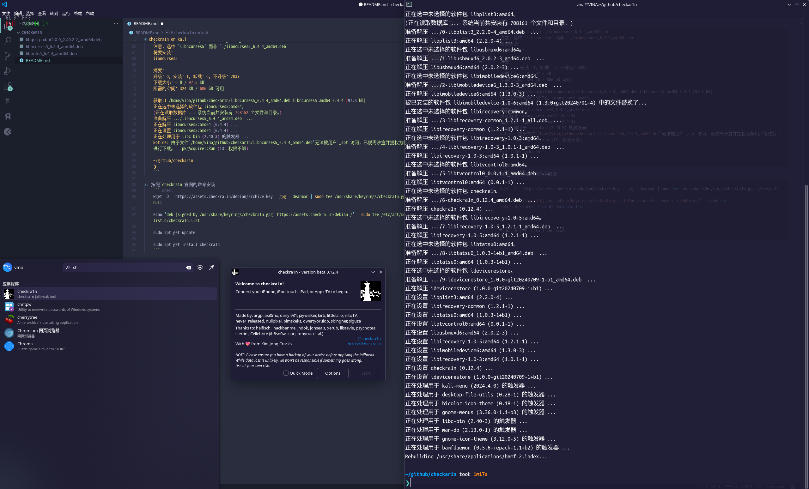

# checkra1n on kali
近日尝试在kali安装checkra1n以绕过苹果设备锁, 发现有若干包kali不再提供, 特整理如上.

安装顺序如下:
1. 克隆并终端进入本项目目录
2. 安装依赖  
安装本项目包应使用`apt`命令而不是`dpkg`, 还要注意包的安装顺序如下:  
    + `sudo apt install ./libgdk-pixbuf2.0-0_2.40.2-2_amd64.deb`  
    + `sudo apt install ./libtinfo5_6.4-4_amd64.deb`  
    + `sudo apt install ./libncurses5_6.4-4_amd64.deb`  

    ``` shell
    ~/github/checkar1n 
    ❯ sudo apt install ./libgdk-pixbuf2.0-0_2.40.2-2_amd64.deb    
    [sudo] vina 的密码：
    注意，选中 'libgdk-pixbuf2.0-0' 而非 './libgdk-pixbuf2.0-0_2.40.2-2_amd64.deb'
    将要安装：
    libgdk-pixbuf2.0-0

    将要安装的依赖：
    libgdk-pixbuf-xlib-2.0-0

    摘要：
    升级：0，安装：2，卸载：0，不升级：2037
    下载大小：40.6 kB / 54.8 kB
    所需的空间：119 kB / 606 GB 可用

    是否继续？ [Y/n] y
    获取:1 /home/vina/github/checkar1n/libgdk-pixbuf2.0-0_2.40.2-2_amd64.deb libgdk-pixbuf2.0-0 amd64 2.40.2-2 [14.1 kB]
    获取:2 https://kali.download/kali kali-rolling/main amd64 libgdk-pixbuf-xlib-2.0-0 amd64 2.40.2-5 [40.6 kB]
    已下载 40.6 kB，耗时 12秒 (3,342 B/s)                                          
    正在选中未选择的软件包 libgdk-pixbuf-xlib-2.0-0:amd64。
    (正在读取数据库 ... 系统当前共安装有 708136 个文件和目录。)
    准备解压 .../libgdk-pixbuf-xlib-2.0-0_2.40.2-5_amd64.deb  ...
    正在解压 libgdk-pixbuf-xlib-2.0-0:amd64 (2.40.2-5) ...
    正在选中未选择的软件包 libgdk-pixbuf2.0-0:amd64。
    准备解压 .../libgdk-pixbuf2.0-0_2.40.2-2_amd64.deb  ...
    正在解压 libgdk-pixbuf2.0-0:amd64 (2.40.2-2) ...
    正在设置 libgdk-pixbuf-xlib-2.0-0:amd64 (2.40.2-5) ...
    正在设置 libgdk-pixbuf2.0-0:amd64 (2.40.2-2) ...
    正在处理用于 libc-bin (2.40-3) 的触发器 ...
    Notice: 由于文件'/home/vina/github/checkar1n/libgdk-pixbuf2.0-0_2.40.2-2_amd64.deb'无法被用户'_apt'访问，已脱离沙盒并提权为根用户来进行下载。 - pkgAcquire::Run (13: 权限不够)

    ~/github/checkar1n took 31s 
    ❯ sudo apt install ./libtinfo5_6.4-4_amd64.deb            
    注意，选中 'libtinfo5' 而非 './libtinfo5_6.4-4_amd64.deb'
    将要安装：
    libtinfo5

    摘要：
    升级：0，安装：1，卸载：0，不升级：2037
    下载大小：0 B / 328 kB
    所需的空间：544 kB / 606 GB 可用

    获取:1 /home/vina/github/checkar1n/libtinfo5_6.4-4_amd64.deb libtinfo5 amd64 6.4-4 [328 kB]
    正在选中未选择的软件包 libtinfo5:amd64。
    (正在读取数据库 ... 系统当前共安装有 708144 个文件和目录。)
    准备解压 .../libtinfo5_6.4-4_amd64.deb  ...
    正在解压 libtinfo5:amd64 (6.4-4) ...
    正在设置 libtinfo5:amd64 (6.4-4) ...
    正在处理用于 libc-bin (2.40-3) 的触发器 ...
    Notice: 由于文件'/home/vina/github/checkar1n/libtinfo5_6.4-4_amd64.deb'无法被用户'_apt'访问，已脱离沙盒并提权为根用户来进行下载。 - pkgAcquire::Run (13: 权限不够)

    ~/github/checkar1n 
    ❯ sudo apt install ./libncurses5_6.4-4_amd64.deb    
    注意，选中 'libncurses5' 而非 './libncurses5_6.4-4_amd64.deb'
    将要安装：
    libncurses5

    摘要：
    升级：0，安装：1，卸载：0，不升级：2037
    下载大小：0 B / 97.5 kB
    所需的空间：324 kB / 606 GB 可用

    获取:1 /home/vina/github/checkar1n/libncurses5_6.4-4_amd64.deb libncurses5 amd64 6.4-4 [97.5 kB]
    正在选中未选择的软件包 libncurses5:amd64。
    (正在读取数据库 ... 系统当前共安装有 708152 个文件和目录。)
    准备解压 .../libncurses5_6.4-4_amd64.deb  ...
    正在解压 libncurses5:amd64 (6.4-4) ...
    正在设置 libncurses5:amd64 (6.4-4) ...
    正在处理用于 libc-bin (2.40-3) 的触发器 ...
    Notice: 由于文件'/home/vina/github/checkar1n/libncurses5_6.4-4_amd64.deb'无法被用户'_apt'访问，已脱离沙盒并提权为根用户来进行下载。 - pkgAcquire::Run (13: 权限不够)

    ~/github/checkar1n 
    ❯ 
    ```

3. 按照`checkra1n`官网的命令安装  
    ``` shell
    wget -O - https://assets.checkra.in/debian/archive.key | gpg --dearmor | sudo tee /usr/share/keyrings/checkra1n.gpg >/dev/null

    echo 'deb [signed-by=/usr/share/keyrings/checkra1n.gpg] https://assets.checkra.in/debian /' | sudo tee /etc/apt/sources.list.d/checkra1n.list

    sudo apt-get update

    sudo apt-get install checkra1n
    ```
    