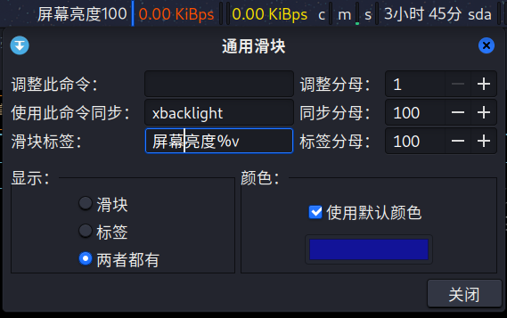

# kali华硕电脑调整屏幕亮度
反正华硕电脑就是不能用默认的`xfce4-power-manager`调整屏幕亮度,我选择把`xbacklight`绑到快捷键

# 安装xbacklight
```
sudo apt install xbacklight
```

> 亮度值从0到100  
> 调**高**10格亮度: `xbacklight +10`  
> 调**低**10格亮度: `xbacklight -10`  
> 调**到**10格亮度: `xbacklight = 10`  

# 用快捷键调
`设置` -> `键盘` -> `应用程序快捷键` -> `添加` -> 你喜欢的快捷键 -> 调高/低/到亮度的命令 -> `确认`

# 用滑块查看
用到[xfce4-通用滑块](https://docs.xfce.org/panel-plugins/xfce4-generic-slider/start)插件  

1. 安装需要用到的软件
```
sudo apt install -y autopoint make git libgtk-3-dev libxfce4ui-2-dev libxfce4panel-2.0-dev
```

2. 按照[xfce4-通用滑块](https://docs.xfce.org/panel-plugins/xfce4-generic-slider/start)官网安装教程
```
git clone https://gitlab.xfce.org/panel-plugins/xfce4-generic-slider.git
cd xfce4-generic-slider
./autogen.sh
make
sudo make install
```

3. 执行完上面的命令发现xfce4面板里根本就没有`通用滑块`, 因为安装路径不正确, 需要手动把文件复制到正确的安装路径  
```
# 把 generic-slider.desktop 文件复制到正确的位置
sudo cp /usr/local/share/xfce4/panel/plugins/generic-slider.desktop /usr/share/xfce4/panel/plugins

# 把 libgeneric-slider.so 文件复制到正确的位置
sudo cp /usr/local/lib/xfce4/panel/plugins/libgeneric-slider.so /usr/lib/x86_64-linux-gnu/xfce4/panel/plugins

# 给文件正确的权限
sudo chmod 644 /usr/share/xfce4/panel/plugins/generic-slider.desktop
sudo chmod 644 /usr/lib/x86_64-linux-gnu/xfce4/panel/plugins/libgeneric-slider.so
```

4. 重启xfce4面板
```
xfce4-panel -r
```
现在, 你能在插件里找到并配置`通用滑块`了  
  
第一行不用填, 重点是第二行, xbacklight取值范围刚好[0,100]

5. 可选步骤  
删除`sudo make install`时创建的无用文件和目录  
(若不放心, 可亲自去看一眼, 确实只有`generic-slider.desktop`,`libgeneric-slider.so`,`libgeneric-slider.la`这3个文件)
```
sudo rm -rf /usr/local/share/xfce4
sudo rm -rf /usr/local/lib/xfce4
```