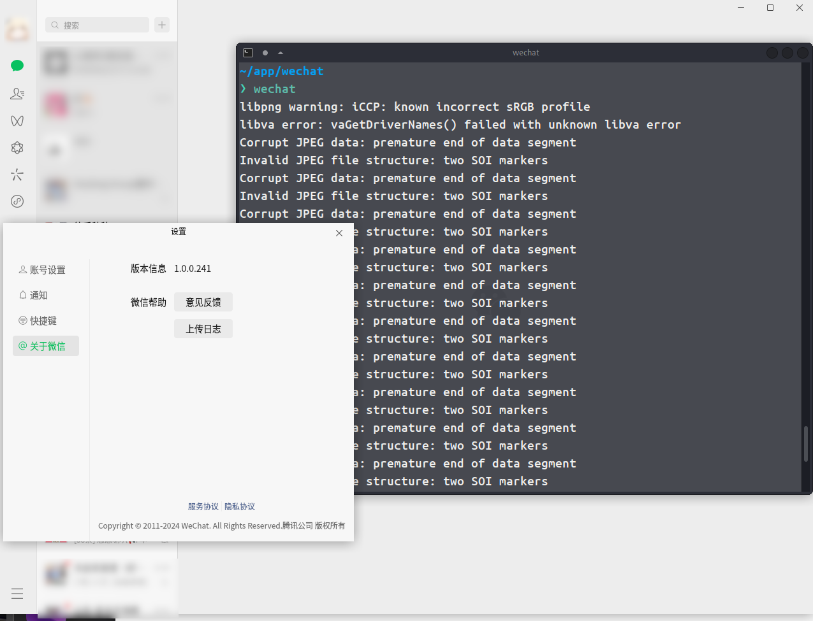

# 微信正确的安装顺序是这样的: 
```shell
mkdir wechat && cd wechat
```
```shell
wget https://community-packages.deepin.com/deepin/pool/main/d/deepin-elf-verify/deepin-elf-verify_1.2.0.6-1_amd64.deb
```
```shell
wget http://archive.ubuntu.com/ubuntu/pool/main/o/openssl/libssl1.1_1.1.1-1ubuntu2.1\~18.04.23_amd64.deb
```
```shell
wget https://archive.ubuntukylin.com/software/pool/partner/weixin_2.1.1_amd64.deb
```
```shell
wget https://home-store-packages.uniontech.com/appstore/pool/appstore/c/com.tencent.wechat/com.tencent.wechat_1.0.0.241_amd64.deb
```
一定要注意下文安装顺序:
```shell
sudo dpkg -i libssl1.1_1.1.1-1ubuntu2.1~18.04.23_amd64.deb
```
```shell
sudo dpkg -i deepin-elf-verify_1.2.0.6-1_amd64.deb
```

这个微信好用:
```shell
sudo dpkg -i com.tencent.wechat_1.0.0.241_amd64.deb
```

我确信, 得安装这个难用的微信, 上面的微信才能用, 并且还要注意安装顺序:
```shell
sudo dpkg -i weixin_2.1.1_amd64.deb
```
至此,微信已经安装好了,可在命令行使用`wechat`运行好用的微信, 也可使用`weixin`运行难用的微信


# 把微信加到`whisker`应用程序列表
1. 安装`alacarte`启动菜单编辑器
```
sudo apt install alacarte
```
2. 运行`alacarte`并添加 Name:微信,Command:wechat

# 后记
如果安装顺序混乱, 会出现两种情况
1. 找不到依赖: 缺什么安装什么
2. 因缺少xxx文件, 无法卸载/未完全安装微信: 缺少什么就`touch`什么,先`sudo apt remove`卸载微信,再按顺序安装微信