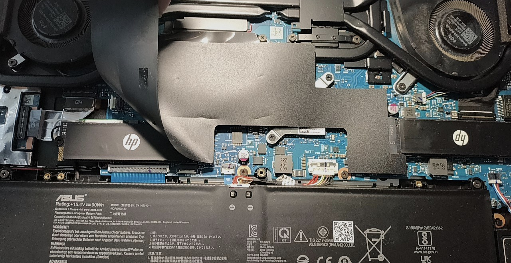
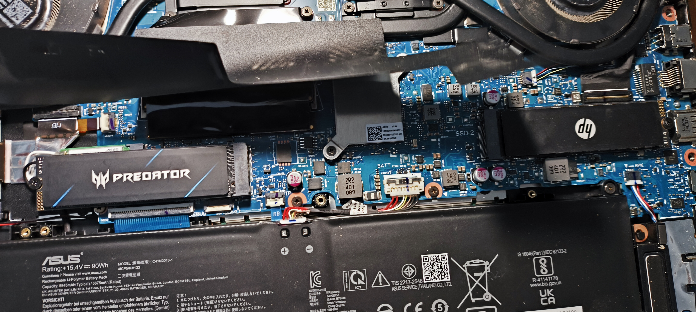
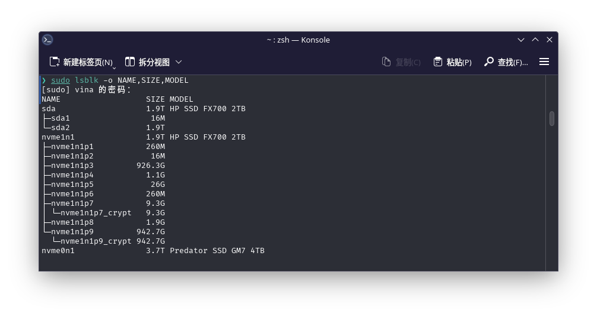
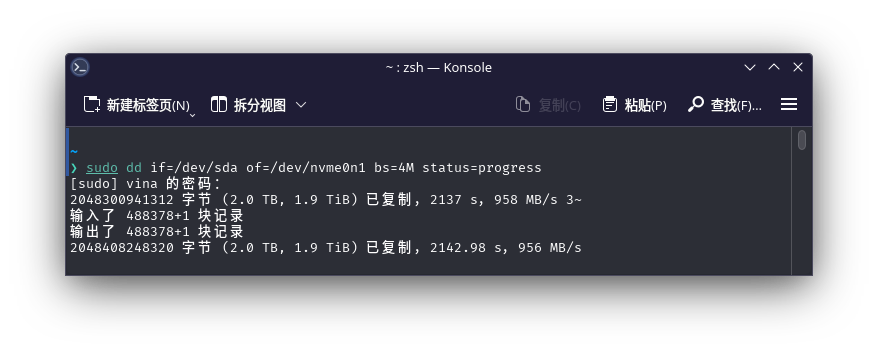
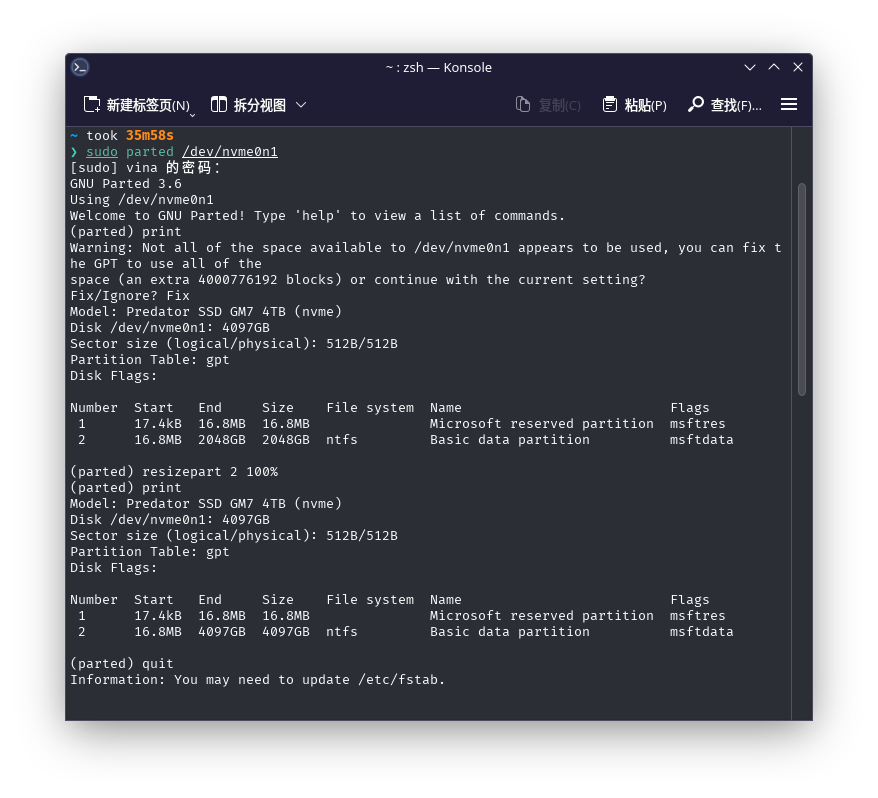
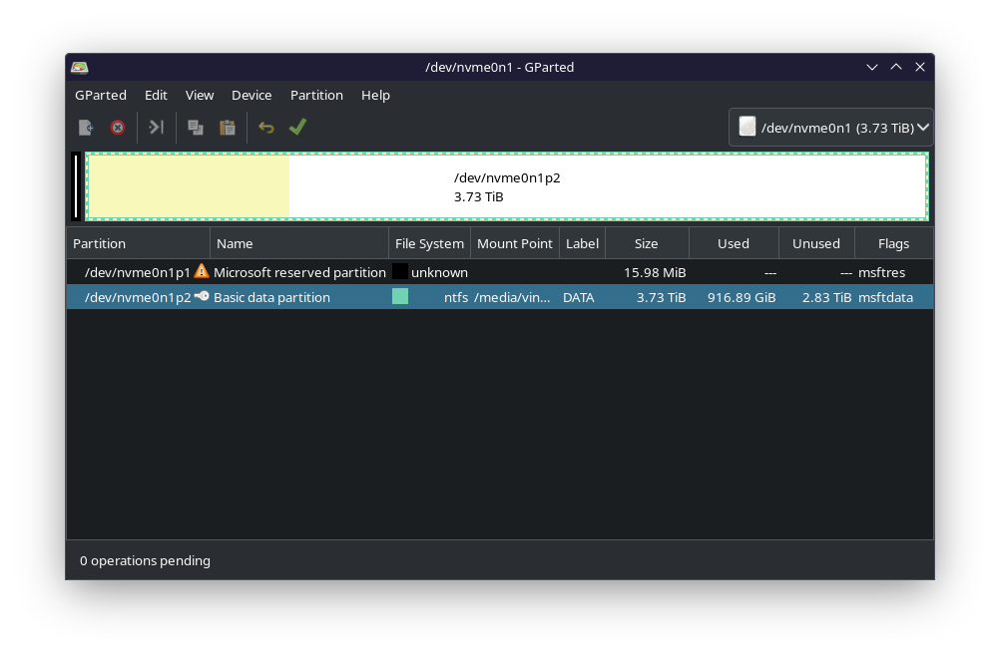
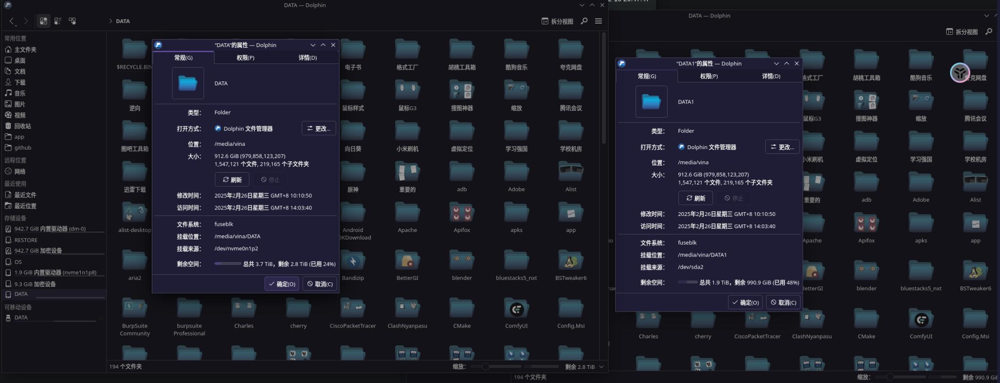

# 电脑更换硬盘并完全克隆数据

新买一块`GM7 4TB`固态硬盘,想替换掉电脑原来的`FX700 2TB`硬盘,并完全克隆过来硬盘数据

## 拆机
  
我电脑有两个硬盘位, 一个在导热膜底部, 一个没有导热膜, 有导热膜的硬盘位是主硬盘位  
在windows任务管理器查看硬盘,我会发现列表里先显示D盘然后显示C盘,我的电脑主硬盘位是D盘,即左侧D盘右侧C盘  
我想把D盘换成新硬盘,即更换左侧硬盘


## 开机及克隆
我想了,我的win三方软件均安装在旧D盘, 我想把旧D盘数据完整克隆到新硬盘, 我不能保证win在启动后有可能出现各类磁盘占用问题导致无法完整克隆, 我尝试在linux克隆硬盘.
- 连接硬盘  
    将替换下来旧硬盘放入硬盘盒, 然后连接到电脑

- 列出磁盘信息
    ```
    sudo lsblk -o NAME,SIZE,MODEL
    ```
    
    其中`sda`是我放入硬盘盒的旧硬盘, `nvme0n1`是我电脑内的新硬盘

- dd克隆
    ```
    sudo dd if=/dev/sda of=/dev/nvme0n1 bs=4M status=progress
    ```
    
    通过dd命令将旧硬盘数据完整克隆到新硬盘, 分区表也会复制过来

- 修正分区表  
    旧硬盘是2TB容量, 新硬盘是4TB容量, dd命令会将分区表也克隆过来导致硬盘没有完全使用
    ```
    sudo parted /dev/nvme0n1
    ```
    
    这样我们重新将分区表变成硬盘最大容量

- 修正文件系统容量  
    这和分区表是两回事, 大致可以理解为分区表负责划分使用哪里物理颗粒, 文件系统负责如何储存和处理硬盘上的文件, 上一步我们告诉分区表这块硬盘容量不是2TB而是4TB, 这一步我们要告诉文件系统使用硬盘全部容量
    ```
    gparted
    ```
    上一步多余了, 因为gparted磁盘管理工具有图形界面, 在gparted重新划分分区容量,直接把我们数据所在分区拉满就是了, gparted会帮我们解决各种问题  
    

- 挂载并查看文件
    
    文件数量和容量一模一样,完美